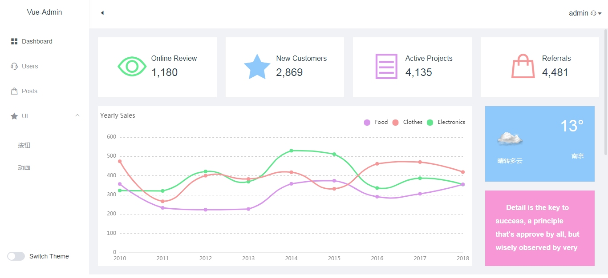

# vue-admin-authority

### 依赖模块
<span style="color: rgb(184,49,47);">项目是用vue-cli 3.x创建的，[Vue CLI 3](https://cli.vuejs.org/).</span>
- [vue](https://cn.vuejs.org/)
- [vue-router](https://router.vuejs.org/zh/)(<span style="color: rgb(243,121,52);">vue路由</span>)
- [vuex](https://vuex.vuejs.org/zh/guide/)(store 设计)
- [axios](https://github.com/mzabriskie/axios)(<span style="color: rgb(243,121,52);">http请求模块，封装了request和service模块</span>)
- [nprogress](https://github.com/rstacruz/nprogress)(<span style="color: rgb(243,121,52);">顶部加载条，路由更新调用</span>)
- [postcss](https://github.com/postcss/postcss)(<span style="color: rgb(243,121,52);">postcss</span>)

## Project setup
```
npm install
```

### Compiles and hot-reloads for development
```
npm run serve
```

### Compiles and minifies for production
```
npm run build
```

### Run your tests
```
npm run test
```

### Lints and fixes files
```
npm run lint
```

### Dashboard
<p align="center">
  
</p>

#### todo
- 其他模块以及组件
